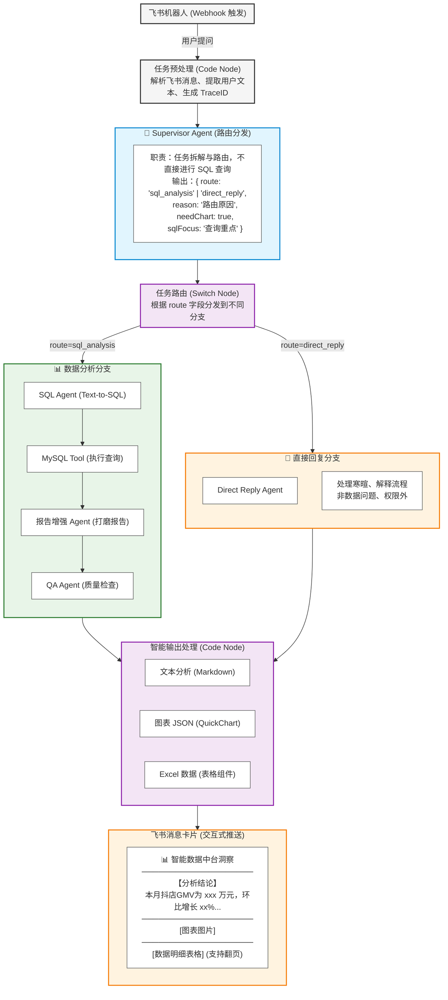
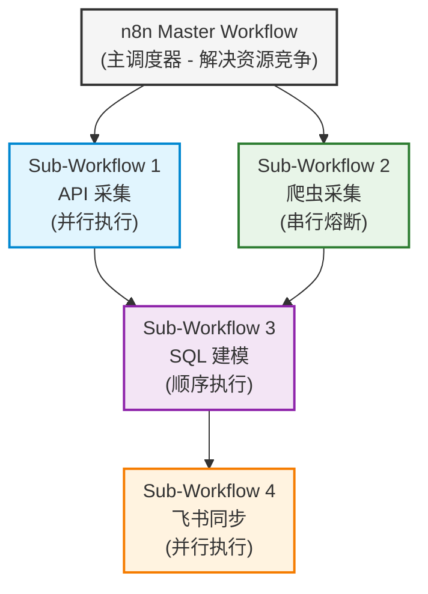
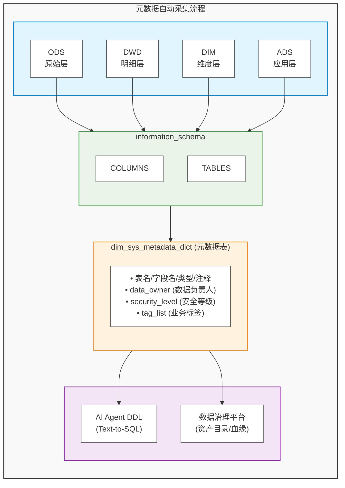
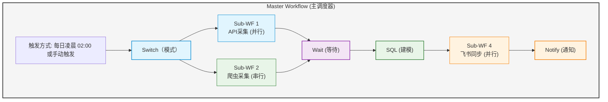
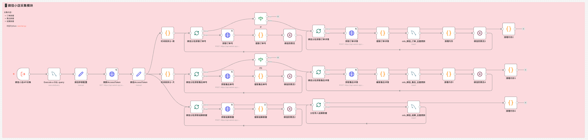
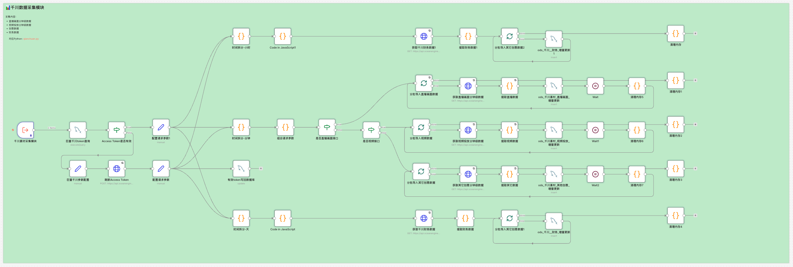
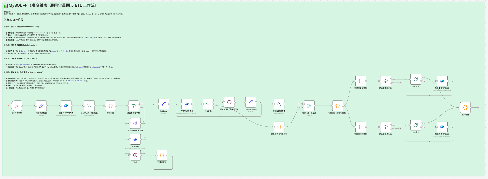

# 电商全域数据中台 & n8n 自动化分析系统 (Data-Agent Hub)

[](https://www.python.org/)
[](https://n8n.io/)
[](https://www.mysql.com/)
[](https://www.docker.com/)
[](https://open.feishu.cn/)
[](https://pandas.pydata.org/)
[](https://pola.rs/)
[]()
[](LICENSE)
[](https://star-history.com/#<YOUR_USERNAME>/n8n-Multi_Agent_Workflow&Date)

> 基于 **Python CLI 脚本 + n8n 工作流引擎** 的解耦式数据中台架构，实现多平台电商数据采集、数仓建模与飞书自动化同步。

---

## 🚀 项目概述 (Project Overview)

本项目是一套面向传媒电商业务的全域数据中台解决方案，覆盖 **抖店、小红书、微信视频号、巨量千川、电商罗盘** 五大平台。系统采用 **"Python CLI 脚本 + n8n 工作流引擎"** 的解耦架构：

- **底层业务逻辑**：Python CLI 脚本实现 ETL 提取、SQL 建模、飞书同步
- **调度编排层**：n8n 实现 Master-Sub 工作流调度，解决 Cron 绝对时间调度带来的资源竞争问题
- **数据分层**：ODS（原始层）→ DWD（明细层）→ DWS/DIM（主题层）→ADS（应用层）标准数仓建模

**核心能力**：
- 多平台订单/售后/结算数据、投放数据、电商罗盘数据自动化采集（API + 爬虫双模式）
- 分钟级/日级自动化调度，支持增量/全量同步
- 飞书多维表双向同步（MySQL ↔ 飞书）
- 素材智能诊断（Whisper ASR + 千问大模型）
- **🤖 多智能体协作架构（Supervisor Agent 路由分发 + 专业 Agent 协作 + Text-to-SQL + 自动可视化）**
- **🏛️ 企业级数据治理（元数据管理 + 数据字典）**

### 性能指标

| 指标 | 数值 | 说明 |
|------|------|------|
| 日均数据采集量 | 100万+ 条 | 四平台订单+售后+结算 |
| 单次全量采集耗时 | 1.5-2 小时 | 并行执行优化后 |
| AI Agent 响应时间 | 60-120 秒 | Text-to-SQL + 报告生成 |
| 飞书同步延迟 | < 30 秒 | 增量同步 |

### 与传统方案对比

| 维度 | 传统 Cron 调度 | 本项目 Master-Sub 架构 |
|------|----------------|------------------------|
| 资源竞争 | ❌ 多任务同时抢占资源 | ✅ 串行熔断避免 OOM |
| 错误处理 | ❌ 手动排查 | ✅ 自动告警推送 |
| 可视化 | ❌ 黑盒执行 | ✅ n8n 可视化编排 |
| 扩展性 | ❌ 修改需重启 | ✅ 低代码拖拽扩展 |
---

## ✨ 功能特性 (Features)

### API 数据采集

| 平台 | 数据类型 | 字段数量 | 特性 |
|------|----------|----------|------|
| **抖店** | 订单/售后/结算 | 300+/180+/50+ | 多线程、指数退避重试、自动Token刷新、增量采集、异常报警 |
| **小红书** | 订单/售后/结算 | 100+/60+/50+ | 多线程、指数退避重试、数据库Token管理、增量采集、异常报警 |
| **微信视频号** | 订单/售后/结算 | 100+/60+/80+ | 多线程、指数退避重试、自动Token管理、全量采集、异常报警 |
| **巨量千川** | 直播画面/视频/其他创意 | 60+/80+/9 | 多线程、指数退避重试、分钟级数据、数据库Token管理、多账户支持、增量更新、异常报警 |

### 爬虫数据采集

- **内容榜**：热门内容数据采集
- **达人榜**：达人排行榜数据
- **商品榜**：商品销售排行
- **搜索榜**：搜索热词排行
- **店铺榜**：店铺销售排行

### 数据建模

- 自动化 SQL 建表
- 数据仓库分层设计（ODS/DWD/DIM/ADS）
- 支持增量更新

### 飞书同步

- MySQL ↔ 飞书多维表双向同步
- 主键去重、增量同步
- 字段映射、类型转换

### 🏛️ 数据治理与元数据管理

| 能力 | 说明 |
|------|------|
| **自动化元数据采集** | 通过 `information_schema` 自动同步所有业务库表结构 |
| **企业级管理字段** | 支持数据负责人、安全等级、业务标签管理 |
| **幂等增量更新** | `ON DUPLICATE KEY UPDATE` 实现增量同步 |
| **AI Agent 集成** | 为 Text-to-SQL Agent 提供完整的 DDL Schema 上下文 |

**核心价值**：元数据表为 AI Agent 提供结构化的 Schema 上下文，显著提升 Text-to-SQL 准确性。

### 🤖 智能数据分析 Agent

| 能力 | 说明 |
|------|------|
| **多智能体协作** | Supervisor Agent 路由分发 + 专业 Agent 协作处理 |
| **智能路由分发** | 自动判断任务类型，路由到数据分析分支或直接回复分支 |
| **Text-to-SQL** | 用户用自然语言提问，AI 自动生成 SQL 查询语句 |
| **多轮对话记忆** | 基于 LangChain Memory Buffer，支持上下文关联追问 |
| **智能图表生成** | 自动识别数据特征，生成可视化图表（QuickChart API） |
| **报告增强** | 自动打磨分析报告，生成结构化洞察和建议 |
| **QA 质检** | 统一输出质量，修复 Markdown 可读性，确保飞书兼容 |
| **飞书交互卡片** | 推送包含分析结论 + 图表 + 数据表格的交互式消息 |
| **错误自动告警** | 工作流异常时自动推送飞书告警消息 |

**典型应用场景**：
- "帮我分析本月抖店 GMV TOP10 达人"
- "对比上周和本周各平台订单量变化趋势"
- "查询最近7天千川投放各主播的 ROI 数据"

---

## 🤖 智能数据分析 Agent (Multi-Agent Data Analysis System)

### 核心亮点

本项目实现了一套 **多智能体协作架构**（Multi-Agent Architecture），基于 **n8n + LangChain + 千问大模型**，通过 **Supervisor Agent 路由分发** 实现任务智能分流：

```
用户提问（飞书）→ Supervisor Agent（路由分发）→ 专业 Agent 协作处理 → 飞书推送结果
```

> 💡 **数据分析 Agent 工作流截图**：


### 多智能体架构设计



### 四大核心 Agent 职责

| Agent | 职责 | 输入 | 输出 |
|-------|------|------|------|
| **🎯 Supervisor Agent** | 任务拆解与路由分发 | 用户问题 | `{ route, reason, needChart, sqlFocus }` |
| **📊 SQL Agent** | Text-to-SQL 生成与执行 | 用户问题 + 路由计划 | SQL 查询结果 + 分析初稿 |
| **📝 报告增强 Agent** | 打磨分析报告 | 分析初稿 | 结构化报告（结论+洞察+建议+图表配置） |
| **✅ QA Agent** | 统一输出质量 | 增强后报告 | 修复后的 Markdown + 图表 JSON + Excel 数据 |
| **💬 Direct Reply Agent** | 处理非数据问题 | 用户问题 | 直接回复文本 |

### 路由策略

```javascript
// Supervisor Agent 路由规则
{
  "route": "sql_analysis | direct_reply",
  "reason": "路由原因",
  "needChart": true,
  "needExcel": false,
  "sqlFocus": "查询重点"
}

// 路由策略：
// 1. 需要查数据库/统计/趋势/对比/ROI/GMV 等分析任务 -> sql_analysis
// 2. 寒暄、解释流程、非数据问题、权限外问题 -> direct_reply
// 3. 用户意图不清晰但明显偏数据分析 -> 优先 sql_analysis
```

### 核心能力

| 能力 | 说明 |
|------|------|
| **多智能体协作** | Supervisor Agent 路由分发 + 专业 Agent 协作处理 |
| **智能路由分发** | 自动判断任务类型，路由到数据分析分支或直接回复分支 |
| **Text-to-SQL** | 用户用自然语言提问，AI 自动生成 SQL 查询语句 |
| **DDL Schema 注入** | 将数据库表结构注入 System Prompt，确保 SQL 准确性 |
| **报告增强** | 自动打磨分析报告，生成结构化洞察和建议 |
| **QA 质检** | 统一输出质量，修复 Markdown 可读性，确保飞书兼容 |
| **自动可视化** | 智能判断是否需要生成图表，调用 QuickChart API |
| **飞书交互卡片** | 支持 Markdown、图片、表格组件的富文本推送 |
| **错误兜底** | 异常时自动推送告警消息到飞书群 |

### 支持的数据表

| 数据库 | 表名 | 用途 |
|--------|------|------|
| `dwd` | `dwd_电商数据_宽表` | 抖店/微信/小红书全渠道订单+售后+结算明细 |
| `dwd` | `dwd_千川素材h_中间表` | 千川投放素材维度的转化分析 |
| `ads` | `ads_直播素材_m分摊表` | 每分钟每个主播的直播间明细（直播+投放+订单） |

### 使用示例

**用户提问**：
> "帮我分析一下本月抖店的GMV，按达人分组，取前10名"

**AI Agent 自动处理流程**：
1. **Supervisor Agent** 分析意图，输出路由计划：
```json
{
  "route": "sql_analysis",
  "reason": "需要查询数据库统计GMV",
  "needChart": true,
  "sqlFocus": "抖店本月GMV按达人分组TOP10"
}
```

2. 生成 SQL 查询语句：
```sql
SELECT 
    `达人名称`,
    SUM(`买家实付`) as GMV
FROM dwd.dwd_电商数据_宽表
WHERE `平台` = '抖店'
  AND `支付时间` >= '2024-03-01'
  AND `支付时间` < '2024-04-01'
GROUP BY `达人名称`
ORDER BY GMV DESC
LIMIT 10
```
3. **报告增强 Agent** 打磨分析报告：
```markdown
## 📊 本月抖店 GMV TOP10 达人分析

### 一句话结论
本月抖店 GMV 集中度较高，TOP10 达人贡献了 xx% 的总 GMV...

### 核心指标总览
| 排名 | 达人名称 | GMV(万元) | 占比 |
|------|----------|-----------|------|
| 1 | xxx | 123.45 | 15.2% |
| ... | ... | ... | ... |

### 关键洞察
1. 头部达人效应明显...
2. 增长趋势分析...
3. 异常波动提示...

### 可执行建议
1. 优先级1：...
2. 优先级2：...
```

4. **QA Agent** 质量检查，修复格式问题

5. 推送飞书消息卡片（包含分析结论 + 图表 + 数据表格）

### 技术实现

```javascript
// n8n Supervisor Agent 节点配置
{
  "type": "@n8n/n8n-nodes-langchain.agent",
  "parameters": {
    "promptType": "define",
    "text": "={{ $json.userText }}",
    "options": {
      "systemMessage": "=# Role\n你是 Supervisor Agent，只负责任务拆解与路由，不直接进行 SQL 查询。\n\n# Output Rule\n你必须只输出一个 JSON 对象：\n{\n  \"route\": \"sql_analysis 或 direct_reply\",\n  \"reason\": \"一句话说明路由原因\",\n  \"needChart\": true,\n  \"sqlFocus\": \"查询重点\"\n}"
    }
  }
}

// n8n Switch 节点配置（任务路由）
{
  "type": "n8n-nodes-base.switch",
  "parameters": {
    "rules": {
      "values": [
        {
          "conditions": {
            "conditions": [
              {
                "leftValue": "={{ $json.routePlan.route }}",
                "rightValue": "sql_analysis",
                "operator": { "type": "string", "operation": "equals" }
              }
            ]
          },
          "outputKey": "数据分析分支"
        },
        {
          "conditions": {
            "conditions": [
              {
                "leftValue": "={{ $json.routePlan.route }}",
                "rightValue": "direct_reply",
                "operator": { "type": "string", "operation": "equals" }
              }
            ]
          },
          "outputKey": "直接回复分支"
        }
      ]
    }
  }
}

// MySQL Tool 节点配置
{
  "type": "n8n-nodes-base.mySqlTool",
  "parameters": {
    "operation": "executeQuery",
    "query": "{{ $fromAI('sql') }}"
  }
}
```

### 错误处理机制

```
┌─────────────┐     ┌─────────────┐     ┌─────────────┐
│ Error       │────▶│ 飞书推送      │────▶│ 告警消息      │
│ Trigger     │     │ 错误信息      │     │ 卡片         │
└─────────────┘     └─────────────┘     └─────────────┘
```

当工作流执行失败时，自动触发错误兜底节点，推送包含以下信息的告警：
- 工作流名称
- 报错节点
- 错误详情

---

## 🏗️ 核心架构与数仓分层 (Architecture & Data Warehouse)

### 系统架构图



### 数仓分层设计

| 分层 | 数据库 | 说明 | 核心表 |
|------|--------|------|--------|
| **ODS** (Operational Data Store) | `ods` | 原始数据层，保持数据原貌 | `ods_抖店_订单_全量`、`ods_微信_订单_全量`、`ods_红书_订单_全量` |
| **DWD** (Data Warehouse Detail) | `dwd` | 明细数据层，多源合并清洗 | `dwd_电商数据_宽表`（抖店+微信+小红书 UNION ALL） |
| **DIM** (Dimension) | `dim` | 维度数据层 | `dim_达人维度`、`dim_商品维度` |
| **ADS** (Application Data Service) | `ads` | 应用数据层 | 业务指标聚合表 |

> 💡 **设计亮点**：DWD 层通过 `UNION ALL` 实现多平台订单数据统一建模，字段标准化映射，支持跨平台分析。

---

## 📂 目录结构与模块说明 (Directory Structure)

```
n8n-Multi_Agent_Workflow/
├── API_data_collect/          # API 数据采集模块
│   ├── order_D/               # 抖店订单采集
│   │   ├── main.py            # CLI 入口
│   │   └── doudian/           # 抖店 SDK 封装
│   ├── order_H/               # 小红书订单采集
│   │   ├── main.py
│   │   └── xiaohongshu/
│   ├── order_W/               # 微信视频号订单采集
│   │   ├── main.py
│   │   └── weixin/
│   └── qc_material/           # 巨量千川素材采集
│       ├── main.py
│       └── qianchuan/
│
├── web_crawler/               # 爬虫数据采集模块
│   ├── luopan_rank/           # 电商罗盘榜单爬虫
│   │   ├── rank_kol.py        # 达人榜单
│   │   ├── rank_product.py    # 商品榜单
│   │   ├── rank_content.py    # 内容榜单
│   │   └── config.py          # 行业类目配置
│   └── material_ASR/          # 素材智能诊断
│       ├── material_qianchuan.py  # 千川素材分析
│       └── material_rank.py
│
├── SQL_create_table/          # SQL 建表脚本
│   ├── order_total.sql        # DWD 宽表建表语句
│   ├── dim_order_kol.sql      # 达人维度表
│   ├── dim_order_product.sql  # 商品维度表
│   └── dim_Metadata&Dictionary.sql  # 🌟 全域数据字典表
│
├── mysql_syn_feishu/          # 飞书同步模块
│   ├── run_sync.py            # 统一同步入口
│   ├── sync_order_kol.py      # 达人维度同步
│   ├── sync_order_product.py  # 商品维度同步
│   └── feishu_sync/           # 飞书 SDK 封装
│
├── docs/
├── images/
│   ├── master_workflow.png      # n8n 主工作流截图
│   ├── api_workflow.png         # API 采集子工作流截图
│   ├── data_analysis_agent.png  # 数据分析 Agent 截图
│   └── demo.gif                 # 演示动图
|
├── architecture.md              # 详细架构设计文档
└── deployment.md                # 详细部署文档
├── n8n_Workflow/              # n8n 工作流 JSON
│   ├── 数据中台 - 完整ETL工作流Agent.json   # 主ETL工作流
│   ├── 数据分析Agent.json                 # 🤖 AI数据分析Agent（Text-to-SQL）
│   ├── [ETL-WeChat] 订单+售后+结算同步.json
│   └── [MySQL-Feishu] 通用Sync逻辑.json
│
└── n8n_setting/               # n8n Docker 部署配置
    ├── docker-compose.yml
    └── Dockerfile
```

---

## ⚡ 快速使用 (CLI 命令行传参调用示例)

### 环境变量配置

```bash
# 数据库配置
export DB_HOST=<YOUR_DB_HOST>
export DB_PORT=3306
export DB_USER=<YOUR_DB_USER>
export DB_PASSWORD=<YOUR_DB_PASSWORD>
export DB_NAME=ods

# 平台 API 凭证
export DOUDIAN_APP_KEY=<YOUR_APP_KEY>
export DOUDIAN_APP_SECRET=<YOUR_APP_SECRET>
export XHS_APP_KEY=<YOUR_APP_KEY>
export XHS_APP_SECRET=<YOUR_APP_SECRET>
export XHS_ACCESS_TOKEN=<YOUR_ACCESS_TOKEN>
export WEIXIN_APP_ID=<YOUR_APP_ID>
export WEIXIN_APP_SECRET=<YOUR_APP_SECRET>
export QIANCHUAN_APP_ID=<YOUR_APP_ID>
export QIANCHUAN_APP_SECRET=<YOUR_APP_SECRET>
export QIANCHUAN_REFRESH_TOKEN=<YOUR_REFRESH_TOKEN>
```

### 1. 抖店订单采集

```bash
# 默认采集昨天数据
python API_data_collect/order_D/main.py \
    --db_host ${DB_HOST} \
    --db_user ${DB_USER} \
    --db_password ${DB_PASSWORD} \
    --db_name ${DB_NAME}

# 指定时间范围采集
python API_data_collect/order_D/main.py \
    --order_start "2024-01-01 00:00:00" \
    --order_end "2024-01-31 23:59:59" \
    --settle_start "2024-01-01 00:00:00" \
    --db_host ${DB_HOST} \
    --db_user ${DB_USER} \
    --db_password ${DB_PASSWORD} \
    --db_name ${DB_NAME}

# 跳过特定数据类型
python API_data_collect/order_D/main.py \
    --skip_orders \
    --skip_aftersales \
    --db_host ${DB_HOST} \
    --db_user ${DB_USER} \
    --db_password ${DB_PASSWORD} \
    --db_name ${DB_NAME}

# 调整并发线程数
python API_data_collect/order_D/main.py \
    --max_workers 100 \
    --db_host ${DB_HOST} \
    --db_user ${DB_USER} \
    --db_password ${DB_PASSWORD} \
    --db_name ${DB_NAME}
```

### 2. 小红书订单采集

```bash
# 基础采集
python API_data_collect/order_H/main.py \
    --db_host ${DB_HOST} \
    --db_user ${DB_USER} \
    --db_password ${DB_PASSWORD} \
    --db_name ${DB_NAME}

# 指定时间范围
python API_data_collect/order_H/main.py \
    --order_start "2024-01-01 00:00:00" \
    --order_end "2024-01-31 23:59:59" \
    --settle_start "2024-01-01 00:00:00" \
    --db_host ${DB_HOST} \
    --db_user ${DB_USER} \
    --db_password ${DB_PASSWORD} \
    --db_name ${DB_NAME}
```

### 3. 微信视频号订单采集

```bash
# 采集全部数据类型（订单+售后+结算）
python API_data_collect/order_W/main.py \
    --data-type all \
    --start-date "2024-01-01 00:00:00" \
    --end-date "2024-01-31 23:59:59" \
    --db_host ${DB_HOST} \
    --db_user ${DB_USER} \
    --db_password ${DB_PASSWORD} \
    --db_name ${DB_NAME}

# 仅采集订单数据
python API_data_collect/order_W/main.py \
    --data-type order \
    --start-date "2024-01-01 00:00:00" \
    --end-date "2024-01-31 23:59:59" \
    --db_host ${DB_HOST} \
    --db_user ${DB_USER} \
    --db_password ${DB_PASSWORD} \
    --db_name ${DB_NAME}
```

### 4. 巨量千川素材采集

```bash
# 采集全部素材类型（直播间画面+视频+其他创意）
python API_data_collect/qc_material/main.py \
    --data-type all \
    --start-date "2024-01-01 00:00:00" \
    --end-date "2024-01-31 23:59:59" \
    --accounts "advertiser_id:aweme_id:账户名称,advertiser_id2:aweme_id2:账户名称2" \
    --db_host ${DB_HOST} \
    --db_user ${DB_USER} \
    --db_password ${DB_PASSWORD} \
    --db_name ${DB_NAME}

# 仅采集直播间画面数据
python API_data_collect/qc_material/main.py \
    --data-type live \
    --accounts "123456:987654321:测试账户" \
    --db_host ${DB_HOST} \
    --db_user ${DB_USER} \
    --db_password ${DB_PASSWORD} \
    --db_name ${DB_NAME}
```

### 5. 电商罗盘榜单爬虫

```bash
# 达人榜单采集
python web_crawler/luopan_rank/rank_kol.py \
    --start_time "2024-01-01" \
    --end_time "2024-01-31" \
    --cookie "<YOUR_COOKIE>" \
    --db_url "mysql+pymysql://${DB_USER}:${DB_PASSWORD}@${DB_HOST}:3306/ods?charset=utf8mb4"
```

### 6. 飞书数据同步

```bash
# 增量同步所有表
python mysql_syn_feishu/run_sync.py --all

# 全量同步所有表
python mysql_syn_feishu/run_sync.py --all --full-sync

# 同步指定表
python mysql_syn_feishu/run_sync.py --tables kol,product,rank

# 仅同步达人维度表（全量）
python mysql_syn_feishu/run_sync.py --tables kol --full-sync
```

---

## 📦 模块详细说明 (Module Details)

### API 数据采集模块

每个平台的数据采集模块都采用模块化设计：

```
平台模块/
├── __init__.py           # 模块导出
├── config.py             # 配置和映射字典
├── utils.py              # 工具函数
├── client.py             # API客户端
├── token_service.py      # Token管理
├── order_service.py      # 订单服务
├── aftersale_service.py  # 售后服务
└── settle_service.py     # 结算服务
```

**核心特性**：
- ✅ 支持命令行参数传入
- ✅ 支持环境变量配置
- ✅ 多线程批量获取（可配置 `--max_workers`）
- ✅ 自动 Token 刷新
- ✅ 数据库自动写入（支持 `append`/`replace` 模式）

### 爬虫模块

基于 DrissionPage 和 RPC 签名服务实现：

```
web_crawler/
├── luopan_rank/          # 罗盘榜单爬虫
├── JS_a_bogus/           # 签名算法（JS）
├── server.py             # RPC签名服务
└── hook.py               # 浏览器Hook
```

**工作原理**：
1. 启动 Chrome 浏览器（远程调试模式）
2. 运行 hook.py 注入签名算法
3. 启动 server.py 提供 RPC 服务
4. 爬虫脚本调用签名服务获取 a_bogus 参数

### 飞书同步模块

支持 MySQL 与飞书多维表的双向同步：

```python
from feishu_sync import quick_sync_mysql_to_feishu

quick_sync_mysql_to_feishu(
    feishu_app_id="cli_xxx",
    feishu_app_secret="xxx",
    feishu_app_token="xxx",
    feishu_table_id="tblxxx",
    primary_key_field="达人ID",
    mysql_host="localhost",
    mysql_user="root",
    mysql_password="password",
    mysql_database="test_db",
    mysql_table="target_table",
    sql_template="SELECT * FROM source_table",
    update_time_field="update_time",
    full_sync=False
)
```

---

## 📊 数据库表结构 (Database Schema)

### 主要数据表

| 表名 | 说明 | 数据来源 | 分层 |
|------|------|----------|------|
| `ods_抖店_订单_全量` | 抖店订单数据 | 抖店API | ODS |
| `ods_抖店_售后_全量` | 抖店售后数据 | 抖店API | ODS |
| `ods_抖店_结算_全量` | 抖店结算数据 | 抖店API | ODS |
| `ods_红书_订单_全量` | 小红书订单数据 | 小红书API | ODS |
| `ods_红书_售后_全量` | 小红书售后数据 | 小红书API | ODS |
| `ods_红书_结算_全量` | 小红书结算数据 | 小红书API | ODS |
| `ods_微信_订单_全量` | 微信订单数据 | 微信API | ODS |
| `ods_微信_售后_全量` | 微信售后数据 | 微信API | ODS |
| `ods_微信_结算_全量` | 微信结算数据 | 微信API | ODS |
| `ods_千川素材_直播画面_m` | 千川直播分钟数据 | 千川API | ODS |
| `ods_千川素材_视频_h` | 千川视频小时数据 | 千川API | ODS |
| `dwd_电商数据_宽表` | 多平台订单合并宽表 | SQL建模 | DWD |
| `dim_达人维度` | 订单达人维度表 | SQL建模 | DIM |
| `dim_商品维度` | 订单商品维度表 | SQL建模 | DIM |
| `dim_达人榜单` | 榜单达人维度表 | SQL建模 | DIM |
| `dim_sys_metadata_dict` | 🌟 全域数据字典表 | 自动采集 | DIM |

---

## 🏛️ 数据治理与元数据管理 (Data Governance)

### 全域数据字典表 (Metadata Dictionary)

本项目实现了一套**企业级元数据管理系统**，通过 `dim_sys_metadata_dict` 表实现全域数据资产的自动化治理：

```sql
CREATE TABLE dim.dim_sys_metadata_dict (
    `id` bigint(20) unsigned NOT NULL AUTO_INCREMENT COMMENT '主键ID',
    `db_name` varchar(64) NOT NULL COMMENT '库名 (ODS/DWD/DIM/ADS)',
    `table_name` varchar(128) NOT NULL COMMENT '表英文名',
    `table_comment` varchar(256) DEFAULT NULL COMMENT '表中文注释/业务含义',
    `column_name` varchar(128) NOT NULL COMMENT '字段英文名',
    `column_type` varchar(64) DEFAULT NULL COMMENT '字段完整类型',
    `column_comment` text COMMENT '字段业务口径/逻辑说明',
    `is_pk` tinyint(1) DEFAULT '0' COMMENT '是否主键',
    `is_nullable` varchar(10) DEFAULT 'YES' COMMENT '是否允许为空',
    `column_order` int(11) DEFAULT '0' COMMENT '字段排序',
    
    -- 🌟 企业级管理字段
    `data_owner` varchar(64) DEFAULT 'DataTeam' COMMENT '数据负责人',
    `security_level` varchar(20) DEFAULT 'L1' COMMENT '安全等级 (L1:公开, L2:内部, L3:绝密)',
    `tag_list` varchar(255) DEFAULT NULL COMMENT '标签 (如: 财务, 流量, 核心)',
    
    `create_time` datetime DEFAULT CURRENT_TIMESTAMP,
    `update_time` datetime DEFAULT CURRENT_TIMESTAMP ON UPDATE CURRENT_TIMESTAMP,
    
    PRIMARY KEY (`id`),
    UNIQUE KEY `uk_db_table_col` (`db_name`,`table_name`,`column_name`)
) ENGINE=InnoDB DEFAULT CHARSET=utf8mb4 COMMENT='[核心] 全域数据字典与元数据表';
```

### 核心能力

| 能力 | 说明 |
|------|------|
| **自动化元数据采集** | 通过 `information_schema` 自动同步所有业务库表结构 |
| **智能类型拼接** | 保留字段精度（如 `decimal(18,2)`、`varchar(256)`） |
| **企业级管理字段** | 支持数据负责人、安全等级、业务标签管理 |
| **幂等增量更新** | `ON DUPLICATE KEY UPDATE` 实现增量同步，保留手动维护的业务属性 |
| **AI Agent 集成** | 为 Text-to-SQL Agent 提供完整的 DDL Schema 上下文 |

### 数据治理架构



### 与 AI Agent 的协同

元数据表为智能数据分析 Agent 提供了完整的 DDL Schema 上下文：

```javascript
// n8n AI Agent System Prompt 注入
const systemMessage = `
你是一个资深电商数据中台专家，拥有以下数据表：

${metadataDictRows.map(row => 
  `表: ${row.table_name} (${row.table_comment})
   字段: ${row.column_name} - ${row.column_type} - ${row.column_comment}`
).join('\n')}

请根据用户问题生成准确的 SQL 查询语句。
`;
```

> 💡 **设计亮点**：元数据表不仅支持数据治理，还为 AI Agent 提供了结构化的 Schema 上下文，显著提升 Text-to-SQL 的准确性。

---

## ⚙️ n8n 工作流自动化调度设计

### Master-Sub 调度架构

本项目采用 **1 个主工作流 + 4 个子工作流** 的 Master-Sub 架构，解决传统 Cron 绝对时间调度带来的资源竞争问题：

> 💡 **n8n 主工作流调度图**：




### 子工作流详解

#### Sub-Workflow 1: API 数据采集

| 节点 | 命令 | 超时 | 执行策略 |
|------|------|------|----------|
| 抖店订单采集 | `python API_data_collect/order_D/main.py` | 7200s | 并行 |
| 小红书订单采集 | `python API_data_collect/order_H/main.py` | 7200s | 并行 |
| 微信订单采集 | `python API_data_collect/order_W/main.py` | 7200s | 并行 |
| 千川素材采集 | `python API_data_collect/qc_material/main.py` | 3600s | 并行 |

> 💡 **API 采集子工作流截图**：



#### Sub-Workflow 2: 爬虫数据采集

| 节点 | 命令 | 超时 | 执行策略 |
|------|------|------|----------|
| 达人榜单采集 | `python web_crawler/luopan_rank/rank_kol.py` | 10800s | **串行** |
| 商品榜单采集 | `python web_crawler/luopan_rank/rank_product.py` | 10800s | **串行** |
| 内容榜单采集 | `python web_crawler/luopan_rank/rank_content.py` | 10800s | **串行** |

> ⚠️ **串行熔断机制**：爬虫节点采用串行执行，避免多浏览器实例同时运行导致 OOM。

#### Sub-Workflow 3: SQL 数据建模

```bash
# 批量执行 SQL 建表脚本
for f in SQL_create_table/*.sql; do
    mysql -h ${MYSQL_HOST} -u ${MYSQL_USER} -p"${MYSQL_PASSWORD}" ${MYSQL_DB} < "$f"
done
```

#### Sub-Workflow 4: 飞书数据同步

| 节点 | 命令 | 同步方向 | 执行策略 |
|------|------|----------|----------|
| 主播排期同步 | `sync_live_author_schedule.py` | 飞书→MySQL | 并行 |
| 达人维度同步 | `sync_order_kol.py` | MySQL→飞书 | 并行 |
| 商品维度同步 | `sync_order_product.py` | MySQL→飞书 | 并行 |
| 达人榜单同步 | `sync_rank_kol.py` | MySQL→飞书 | 并行 |

> 💡 **飞书同步逻辑子工作流截图**：


### n8n Execute Command 节点配置示例

```json
{
  "command": "cd /data && python3 API_data_collect/order_D/main.py --db_host ${DB_HOST} --db_user ${DB_USER} --db_password ${DB_PASSWORD} --db_name ${DB_NAME}",
  "executeOnce": true,
  "timeout": 7200,
  "continueOnFail": false
}
```

### n8n 节点逻辑映射表

#### 主工作流节点映射 (Master Workflow)

| 节点名称 | 节点类型 | 功能说明 | 关键参数 |
|----------|----------|----------|----------|
| `Manual Trigger` | `n8n-nodes-base.manualTrigger` | 手动触发入口 | - |
| `Schedule Trigger` | `n8n-nodes-base.scheduleTrigger` | 定时触发（每日02:00） | `cron: "0 2 * * *"` |
| `Switch` | `n8n-nodes-base.switch` | 模式选择（全量/增量） | `conditions: mode` |
| `Execute Workflow` | `n8n-nodes-base.executeWorkflow` | 调用子工作流 | `workflowId: "sub-workflow-id"` |
| `Wait` | `n8n-nodes-base.wait` | 等待所有采集完成 | `amount: 1, unit: hours` |
| `Error Trigger` | `n8n-nodes-base.errorTrigger` | 错误兜底触发器 | - |

#### API 数据采集子工作流节点映射

| 节点名称 | 节点类型 | 执行脚本 | 超时 | 并发 |
|----------|----------|----------|------|------|
| `抖店订单采集` | `n8n-nodes-base.executeCommand` | `python API_data_collect/order_D/main.py` | 7200s | 并行 |
| `小红书订单采集` | `n8n-nodes-base.executeCommand` | `python API_data_collect/order_H/main.py` | 7200s | 并行 |
| `微信订单采集` | `n8n-nodes-base.executeCommand` | `python API_data_collect/order_W/main.py` | 7200s | 并行 |
| `千川素材采集` | `n8n-nodes-base.executeCommand` | `python API_data_collect/qc_material/main.py` | 3600s | 并行 |

#### 爬虫数据采集子工作流节点映射

| 节点名称 | 节点类型 | 执行脚本 | 超时 | 执行策略 |
|----------|----------|----------|------|----------|
| `达人榜单采集` | `n8n-nodes-base.executeCommand` | `python web_crawler/luopan_rank/rank_kol.py` | 10800s | **串行** |
| `商品榜单采集` | `n8n-nodes-base.executeCommand` | `python web_crawler/luopan_rank/rank_product.py` | 10800s | **串行** |
| `内容榜单采集` | `n8n-nodes-base.executeCommand` | `python web_crawler/luopan_rank/rank_content.py` | 10800s | **串行** |
| `搜索榜单采集` | `n8n-nodes-base.executeCommand` | `python web_crawler/luopan_rank/rank_serach.py` | 10800s | **串行** |
| `店铺榜单采集` | `n8n-nodes-base.executeCommand` | `python web_crawler/luopan_rank/rank_shop.py` | 10800s | **串行** |

#### SQL 建模子工作流节点映射

| 节点名称 | 节点类型 | 执行命令 | 超时 |
|----------|----------|----------|------|
| `执行SQL建表` | `n8n-nodes-base.executeCommand` | `for f in *.sql; do mysql ... < "$f"; done` | 1800s |

#### 飞书同步子工作流节点映射

| 节点名称 | 节点类型 | 执行脚本 | 同步方向 | 并发 |
|----------|----------|----------|----------|------|
| `主播排期同步` | `n8n-nodes-base.executeCommand` | `python mysql_syn_feishu/sync_live_author_schedule.py` | 飞书→MySQL | 并行 |
| `达人维度同步` | `n8n-nodes-base.executeCommand` | `python mysql_syn_feishu/sync_order_kol.py` | MySQL→飞书 | 并行 |
| `商品维度同步` | `n8n-nodes-base.executeCommand` | `python mysql_syn_feishu/sync_order_product.py` | MySQL→飞书 | 并行 |
| `达人榜单同步` | `n8n-nodes-base.executeCommand` | `python mysql_syn_feishu/sync_rank_kol.py` | MySQL→飞书 | 并行 |

#### 数据分析 Agent 节点映射（多智能体架构）

| 节点名称 | 节点类型 | 功能说明 | 关键配置 |
|----------|----------|----------|----------|
| `Webhook` | `n8n-nodes-base.webhook` | 飞书机器人入口 | `httpMethod: POST, path: feishu-bot` |
| `任务预处理` | `n8n-nodes-base.code` | 解析飞书消息、提取文本 | 提取 userText、chatId、traceId |
| `Supervisor Agent` | `@n8n/n8n-nodes-langchain.agent` | 🎯 路由分发 Agent | 输出 `{ route, reason, needChart, sqlFocus }` |
| `解析路由结果` | `n8n-nodes-base.code` | 解析 Supervisor 输出 | 默认进入数据分析分支 |
| `任务路由` | `n8n-nodes-base.switch` | 根据 route 分发任务 | `sql_analysis` / `direct_reply` |
| `SQL Agent` | `@n8n/n8n-nodes-langchain.agent` | 📊 Text-to-SQL Agent | DDL Schema 注入 + MySQL Tool |
| `MySQL Tool` | `n8n-nodes-base.mySqlTool` | 执行 SQL 查询 | `query: {{ $fromAI('sql') }}` |
| `报告增强 Agent` | `@n8n/n8n-nodes-langchain.agent` | 📝 打磨分析报告 | 输出结构化洞察 + 图表配置 |
| `QA Agent` | `@n8n/n8n-nodes-langchain.agent` | ✅ 质量检查 Agent | 修复 Markdown + 图表 JSON |
| `Direct Reply Agent` | `@n8n/n8n-nodes-langchain.agent` | 💬 直接回复 Agent | 处理寒暄、非数据问题 |
| `分离文本和图表` | `n8n-nodes-base.code` | 解析 AI 输出 | 提取 Markdown/JSON/Excel |
| `图片生成判断` | `n8n-nodes-base.if` | 判断是否需要生成图表 | `hasChart == true` |
| `生成图片` | `n8n-nodes-base.httpRequest` | 调用 QuickChart API | `url: https://quickchart.io/chart` |
| `上传图片` | `n8n-nodes-base.httpRequest` | 上传图片到飞书 | `url: https://open.feishu.cn/open-apis/im/v1/images` |
| `飞书推送数据分析结果` | `n8n-nodes-feishu-lite.feishuNode` | 推送消息卡片 | `msg_type: interactive` |
| `错误兜底` | `n8n-nodes-base.errorTrigger` | 错误触发器 | - |
| `飞书推送错误信息` | `n8n-nodes-feishu-lite.feishuNode` | 推送告警卡片 | `template: red` |


### 执行时间规划

| 时间 | 任务 | 执行方式 | 预计时长 |
|------|------|----------|----------|
| 02:00 | API 数据采集 | 并行 | 2 小时 |
| 03:00 | 爬虫数据采集 | 串行 | 3 小时 |
| 04:00 | SQL 建表 | 串行 | 30 分钟 |
| 04:30 | 飞书同步 | 并行 | 30 分钟 |

> 💡 **调度优化建议**：爬虫任务采用串行执行避免资源竞争，API 采集和飞书同步采用并行执行提升效率。

---

## 🛡️ 容错与高可用机制 (Fault Tolerance)

### 1. API 限流指数退避重试 (Exponential Backoff)

```python
# API_data_collect/order_D/doudian/client.py
def request_with_retry(self, method, params, max_retries=3):
    for attempt in range(max_retries):
        try:
            result = self.request(method, params)
            if result:
                return result
            wait_time = (2 ** attempt) + 1  # 1s, 3s, 5s
            time.sleep(wait_time)
        except Exception as e:
            if attempt == max_retries - 1:
                raise e
            time.sleep((2 ** attempt) + 1)
    return None
```

### 2. 爬虫串行熔断防 OOM

```python
# web_crawler/luopan_rank/rank_kol.py
# 采用 DrissionPage + Chromium 无头模式
co = ChromiumOptions()
co.headless(True)
co.set_argument('--no-sandbox')
co.set_argument('--disable-gpu')
co.no_imgs(True)  # 无图模式省流加速

# 串行执行每个榜单采集，避免多浏览器实例 OOM
for category in INDUSTRY_CATEGORY:
    for target_date in date_range:
        for rank_cat in RANK_CATEGORY:
            # 单个榜单采集完成后释放资源
            process_rank(category, target_date, rank_cat)
```

### 3. SQL 安全注入防护

```python
# mysql_syn_feishu/feishu_sync/mysql_to_feishu.py
# 使用参数化查询，防止 SQL 注入
SYNC_SQL_TEMPLATE = """
    SELECT * FROM {table}
    WHERE update_time > %s
"""

cursor.execute(SYNC_SQL_TEMPLATE.format(table=self.table_name), (last_sync_time,))
```

### 4. 飞书同步幂等性设计

```python
# 基于 primary_key_field 实现增量同步
# 已存在的记录自动更新，新记录自动插入
syncer = MySQLToFeishuSync(
    feishu_config=FEISHU_CONFIG,
    mysql_config=MYSQL_CONFIG,
    primary_key_field="达人UID"  # 主键去重
)
syncer.sync(full_sync=False)  # 增量同步
```

### 5. n8n 工作流错误处理

| 错误类型 | 处理策略 | 重试次数 |
|----------|----------|----------|
| API 采集失败 | 指数退避重试 | 3 次 |
| 爬虫采集失败 | 记录日志，继续执行 | 2 次 |
| SQL 建表失败 | 记录失败 SQL，继续执行其他 | 3 次 |
| 飞书同步失败 | 重试后发送告警 | 2 次 |

---

## 📞 技术栈概览 (Tech Stack)

| 分类 | 技术栈 | 用途 |
|------|--------|------|
| **编程语言** | Python 3.9+ | 核心业务逻辑开发 |
| **工作流引擎** | n8n | 自动化调度编排 + AI Agent |
| **AI/LLM** | LangChain, Qwen (通义千问) | 智能数据分析、Text-to-SQL |
| **数据库** | MySQL 8.0 | 数仓分层存储 |
| **爬虫框架** | DrissionPage | 浏览器自动化 |
| **数据处理** | Pandas, SQLAlchemy | ETL 数据处理 |
| **大模型** | Whisper (ASR), Qwen | 素材智能诊断 |
| **可视化** | QuickChart API | 动态图表生成 |
| **协作平台** | 飞书多维表/机器人 | 数据可视化与协作 |
| **容器化** | Docker, docker-compose | 环境部署 |

---

## 📋 快速部署

### 环境要求

| 组件 | 版本要求 | 说明 |
|------|----------|------|
| Python | 3.9+ | 核心业务逻辑 |
| Docker | 20.10+ | n8n 容器化部署 |
| Docker Compose | 2.0+ | 容器编排 |
| MySQL | 5.7+ / 8.0 | 数仓存储 |
| Node.js | 16+ | 可选，用于签名服务 |

### 安装依赖

```bash
# 克隆项目
git clone https://github.com/<YOUR_USERNAME>/n8n-Multi_Agent_Workflow.git
cd n8n-Multi_Agent_Workflow

# 安装 Python 依赖
pip install -r requirements.txt
```

### 配置环境变量

```bash
# 复制环境变量模板
cp .env.example .env

# 编辑 .env 文件，填入真实凭证
vim .env
```

**`.env` 文件配置说明**：

| 配置分类 | 必填项 | 说明 |
|----------|--------|------|
| **数据库** | `DB_HOST`, `DB_USER`, `DB_PASSWORD`, `DB_NAME` | MySQL 连接配置 |
| **抖店 API** | `DOUDIAN_APP_KEY`, `DOUDIAN_APP_SECRET` | 抖店开放平台凭证 |
| **小红书 API** | `XHS_APP_KEY`, `XHS_APP_SECRET`, `XHS_ACCESS_TOKEN` | 小红书开放平台凭证 |
| **微信 API** | `WEIXIN_APP_ID`, `WEIXIN_APP_SECRET` | 微信开放平台凭证 |
| **千川 API** | `QIANCHUAN_APP_ID`, `QIANCHUAN_APP_SECRET`, `QIANCHUAN_REFRESH_TOKEN` | 巨量千川凭证 |
| **飞书 API** | `FEISHU_APP_ID`, `FEISHU_APP_SECRET`, `FEISHU_APP_TOKEN` | 飞书开放平台凭证 |
| **大模型 API** | `DASHSCOPE_API_KEY` | 通义千问 API Key |
| **n8n** | - | n8n 服务配置（默认即可） |

### 启动 n8n

```bash
cd n8n_setting
docker-compose up -d
```

访问 `http://localhost:5678` 进入 n8n 界面。

### 导入工作流

1. 打开 n8n 界面
2. 点击 **"Import from File"**
3. 选择 `n8n_Workflow/` 目录下的 JSON 文件：
   - `数据中台 - 完整ETL工作流Agent.json` - 主 ETL 工作流
   - `数据分析Agent.json` - 🤖 AI 数据分析 Agent
   - `[ETL-WeChat] 订单+售后+结算同步.json` - 微信数据采集
   - `[MySQL-Feishu] 通用Sync逻辑.json` - 飞书同步逻辑
4. 配置环境变量和凭证
5. 点击 **"Execute Workflow"** 测试运行

---

## ❓ 常见问题 (FAQ)

### 1. 脚本路径问题

确保使用相对路径或基于脚本位置的路径：

```bash
SCRIPT_DIR="$(cd "$(dirname "$0")" && pwd)"
cd "$SCRIPT_DIR"
```

### 2. Token 过期处理

各平台 Token 有效期：

| 平台 | Token 有效期 | 处理方式 |
|------|-------------|----------|
| 抖店 | 7 天 | 自动刷新 |
| 小红书 | 需手动刷新 | 手动更新 |
| 微信视频号 | 2 小时 | 自动刷新 |
| 巨量千川 | 2 小时 | 自动刷新 |

### 3. API 限流处理

默认线程数已优化，如遇限流可降低线程数：

```bash
python main.py --max_workers 20
```

### 4. 数据库连接失败

检查项：
- ✅ 环境变量是否正确
- ✅ 网络连通性
- ✅ 数据库用户权限
- ✅ 防火墙配置

### 5. 爬虫 OOM 问题

**原因**：多浏览器实例同时运行

**解决方案**：
- 采用串行执行策略
- 启用无头模式 `co.headless(True)`
- 启用无图模式 `co.no_imgs(True)`

---

## 🔐 安全建议 (Security)

### 1. 敏感信息管理

- ⚠️ 使用环境变量存储密钥，不要硬编码
- ⚠️ 不要将密钥提交到版本控制
- ⚠️ 定期更换 API 密钥
- ⚠️ 使用 `.env` 文件并添加到 `.gitignore`

### 2. 访问控制

- 🔒 限制数据库访问 IP
- 🔒 使用最小权限原则
- 🔒 启用 n8n 基本认证
- 🔒 定期审计访问日志

### 3. 数据安全

- 💾 定期备份数据库
- 💾 敏感数据加密存储
- 💾 日志脱敏处理
- 💾 数据传输使用 SSL/TLS

---

## 📝 更新日志 (Changelog)

### v2.0.0 (2024-03)
- ✨ 重构为模块化架构
- ✨ 支持 n8n 工作流编排
- ✨ 新增飞书同步模块
- ✨ 优化爬虫签名服务
- ✨ 新增素材智能诊断（Whisper + Qwen）
- ✨ **新增多智能体协作架构（Supervisor Agent 路由分发 + 专业 Agent 协作）**
- ✨ **新增企业级数据治理（元数据管理 + 数据字典）**

### v1.0.0
- 🎉 初始版本
- 🎉 单文件脚本

---

## 📄 License

MIT License - 详见 [LICENSE](LICENSE) 文件

---

## 🤝 贡献指南

欢迎提交 Issue 和 Pull Request！

1. Fork 本仓库
2. 创建特性分支 (`git checkout -b feature/AmazingFeature`)
3. 提交更改 (`git commit -m 'Add some AmazingFeature'`)
4. 推送到分支 (`git push origin feature/AmazingFeature`)
5. 开启 Pull Request

---

> **注意**：本项目仅供学习交流使用，请勿用于商业用途。使用前请确保遵守各平台 API 使用规范。
